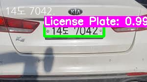

## Licence-Plate-Recognition

### Licence Plate Detection with YOLO

from Darknet, get pretrained YOLO v3 model and weights

    python object_detection_yolo.py --image test_image/car_snow.jpg

* detection된 번호판이 crop되도록 코드수정
* 동영상 input용 코드 추후 업데이트 예정

### Licence Plate Recognition with Google/Naver API

    python google_cloud_ocr.py

    python naver_cloud_ocr.py

* wild한 환경의 인식을 위해선 추가학습이 필요

* google과 naver 각 개인 보안 API KEY를 발급받아 사용 가능

----------------------------------------------------------------------------

### Licence Plate Detection with YOLO + Recognition with GoogleAPI
#### Image version

#### Video version

